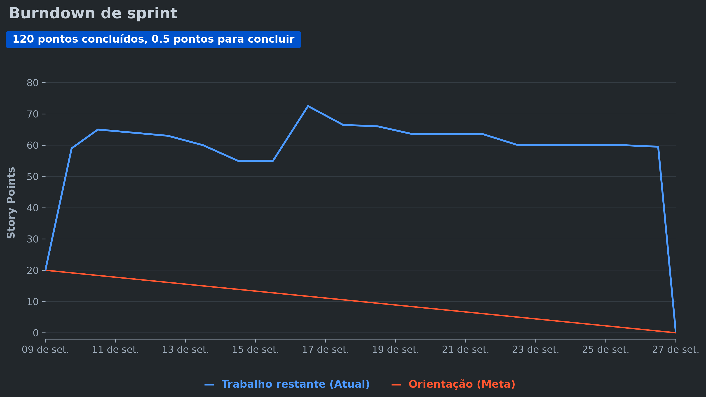

# Documentação - Sprint 1

  <!-- Imagem que aparece apenas no Modo Escuro -->
  
  
  <!-- Imagem que aparece apenas no Modo Claro -->
  
  
  <h3>MIA - Assistente de Análise de Dados</h3>

 

  <a href ="#desafio"> Desafio</a> &nbsp;&bull;&nbsp;
  <a href ="#us"> User Stories</a> &nbsp;&bull;&nbsp;  
  <a href ="#dor">DoR</a> &nbsp;&bull;&nbsp;
  <a href ="#dod">DoD</a> &nbsp;&bull;&nbsp;
  <a href ="#burndown"> Burndown</a> &nbsp;&bull;&nbsp;
  <a href ="#equipe"> Equipe</a>

---

> [!IMPORTANT]
> **Status do Projeto:**  Concluído ✅

## 🏅 Desafio 

Desenvolver a base do Assistente de Análise de Dados integrado ao Telegram, permitindo que gestores extraiam insights de negócios através de linguagem natural. O desafio central consistiu em processar dados diretamente de planilhas CSV locais (sem persistência de dados) utilizando lógica algorítmica em Python para estruturar o Planejamento de Produção. Foi necessário criar algoritmos capazes de cruzar o histórico de vendas com variáveis externas (como dias da semana e feriados) para prever com exatidão quais e quantos produtos devem ser produzidos, visando a redução de desperdícios de tempo e insumos. Toda a inteligência e processamento foram projetados para operar de forma autônoma, atendendo à restrição rigorosa de não utilizar APIs externas de terceiros.

## 📋 User Stories 

| $\textsf{\textbf{Capacidade estimada da Equipe por Sprint:}}$ | $\textsf{55 Story Points}$ |
|---|---|
| $\color{#2e8b57}{\textsf{\textbf{Meta da Sprint:}}}$ | $\textsf{User Story de rank 1 e rank 2 (\textit{21 Story Points})}$ |
| $\textsf{\textbf{Previsão da Sprint} (\textit{extras, sem compromisso de entrega}):}$ | $\textsf{User Story de rank 3 e rank 4 (\textit{34 Story Points})}$ |

| Rank | Prioridade | User Story | Story Points | Sprint | Status |
| :--: | :--------: | :--- | :----------: | :----: | :----: |
| $\color{#2e8b57}{\textsf{\textbf{1}}}$ | $\color{#2e8b57}{\textsf{\textbf{Alta}}}$ | $\color{#2e8b57}{\textsf{\textbf{Eu, como líder, quero saber quais produtos precisam ser produzidos, a fim de reduzir o desperdício de tempo e produto.}}}$ | $\color{#2e8b57}{\textsf{\textbf{13}}}$ | $\color{#2e8b57}{\textsf{\textbf{1}}}$ | ✅ |
| $\color{#2e8b57}{\textsf{\textbf{2}}}$ | $\color{#2e8b57}{\textsf{\textbf{Alta}}}$ | $\color{#2e8b57}{\textsf{\textbf{Eu, como líder, quero saber quantos produtos precisam ser produzidos, a fim de reduzir o desperdício de tempo e produto.}}}$ | $\color{#2e8b57}{\textsf{\textbf{8}}}$ | $\color{#2e8b57}{\textsf{\textbf{1}}}$ | ✅ |
| $\textsf{3}$ | $\textsf{Média}$ | $\textsf{Eu, como gerente, quero saber o que foi produzido no dia X pelo setor Y, a fim de verificar a produtividade do setor Y.}$ | $\textsf{13}$ | $\textsf{1}$ | ✅ |
| $\textsf{4}$ | $\textsf{Média}$ | $\textsf{Eu, como gerente, quero saber o que deveria ter sido produzido no dia X pelo setor Y, a fim de consultar a meta ideal de produção estipulada para a data.}$ | $\textsf{21}$ | $\textsf{1}$ | ✅ |

---

## 🏅 DoR - Definition of Ready 

A avaliação detalhada de DoR e DoD, User Story por User Story, está em [`Checklist - Sprint 1`](./Checklist%20-%20Sprint%201.md).

| Critério | Descrição |
| :--- | :--- |
| **Clareza na Descrição** | A User Story está escrita no formato: "Eu, como [papel], quero [ação], a fim de [objetivo/valor]". |
| **Critérios de Aceitação** | A história possui critérios claros e pelo menos um cenário de teste básico (BDD) mapeado (Dado que... Quando... Então...). |
| **Independente** | A história pode ser desenvolvida sem depender de tarefas bloqueantes dentro da mesma Sprint. |
| **Compreensão Compartilhada** | A equipe entende o propósito e estimou o esforço da tarefa (Story Points definidos). |
| **Mapeamento de Intenções** | Estão documentados exemplos reais de frases em linguagem natural que o usuário pode enviar (ex: "o que eu devo fazer hoje?", "tem produto pra agora?"). |
| **Critérios Técnicos** | Está definido o que o modelo via **DSPy** precisará extrair da frase (parâmetros) e qual arquivo/coluna estática o **Pandas** deverá ler. |

## 🏅 DoD - Definition of Done 

| Critério | Descrição |
| :--- | :--- |
| **Critérios Atendidos** | Todos os critérios de aceitação e cenários de teste da User Story foram cumpridos e validados com sucesso. |
| **Interpretação Validada (NLP)** | A IA interpretou corretamente diferentes variações da mesma pergunta em texto livre, acionando a filtragem correta no Pandas. |
| **Código Revisado** | O código passou por Code Review (Pull Request revisado e aprovado por pelo menos um outro membro da equipe). |
| **Documentação Atualizada** | As novas capacidades de interpretação do bot, a estrutura dos módulos DSPy e os mapeamentos dos CSVs estáticos foram atualizados no README.md. |
| **Integração Validada** | A nova capacidade de resposta não confunde a IA em relação a outras perguntas já suportadas e o bot lida bem com frases fora de contexto. |
| **Validação do PO** | O Product Owner conversou de forma natural com o bot no Telegram e confirmou que o retorno atende à regra de negócio. |
| **Pronto para Deploy** | O código está limpo, mergeado na branch principal e pronto para ser executado. |

## 🏅 Sprint Burndown 

  

 

> [!IMPORTANT]
> **Retrospectiva:** O nosso Burndown Chart reflete um salto nos primeiros dias e um padrão de entregas concentradas no fim (efeito penhasco). O pico inicial ocorreu devido a um erro operacional: a Sprint foi iniciada no Jira antes que os *Story Points* fossem declarados nas *User Stories*. Já a queda brusca no final aconteceu porque os pontos foram atribuídos de forma concentrada na história principal (a "casca"). Como o sistema só "queima" os pontos quando a história inteira é movida para concluída, o esforço contínuo da equipe não foi refletido gradativamente, registrando a entrega total de uma só vez no fechamento da Sprint.
> 
> **Ações para a Sprint 2:** 
> 1. Garantir que o *planning* seja finalizado e todas as estimativas sejam declaradas nos cards **antes** de dar o *start* oficial na Sprint.
> 2. Fracionar as *User Stories* em subtarefas menores e realizar pontuações mais granulares. Isso garantirá que a conclusão de pequenas etapas movimente o fluxo com constância, refletindo o andamento diário da equipe com precisão.

## 🎓 Equipe 

  <table>
    <tr>
      <td align="center">
         
        <b>Henrique de Castro</b> 
        Product Owner 
         
      </td>
      <td align="center">
         
        <b>Felipe Morais</b> 
        Scrum Master 
         
      </td>
    </tr>
  </table>
  <table>
    <tr>
      <td align="center">
         
        <b>Mirela Cristina</b> 
        Dev Team 
         
      </td>
      <td align="center">
         
        <b>Eduardo Granja</b> 
        Dev Team 
         
      </td>
      <td align="center">
         
        <b>Ian Victor</b> 
        Dev Team 
         
      </td>
      <td align="center">
         
        <b>Marcus Vinicius</b> 
        Dev Team 
         
      </td>
    </tr>
  </table>
  <table>
    <tr>
      <td align="center">
         
        <b>Leandro Silva</b> 
        Dev Team 
         
      </td>
      <td align="center">
         
        <b>Adham Goulart</b> 
        Dev Team 
         
      </td>
      <td align="center">
         
        <b>Matheus Correia</b> 
        Dev Team 
         
      </td>
    </tr>
  </table>

---

# 🎓 Contexto acadêmico

A **MIA**, desenvolvida pela **McLorem Tecnologia**, faz parte da **Aprendizagem por Projetos Integrados (API)** do 1º semestre do curso de **Análise e Desenvolvimento de Sistemas da Fatec São José dos Campos**.

 

### MIA - Assistente de Análise de Dados

**McLorem Tecnologia · Fatec São José dos Campos · 2026**

